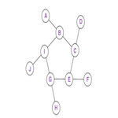

+++
author = "Jenny Zhuo"
title = "The Euler Project"
date = "09/03/2021"
description = "Setting up a blog for the first assignment."
tags = [
    "Math is Fun"
]
categories = [
    "Problem 7: 10001st Prime",
    "Problem 50: Consecutive Prime Sum",
    "Problem 68: Magic 5-gon Ring"
]
series = ["Themes Guide"]
aliases = ["migrate-from-jekyl"]

image = "bg1.jpeg"
+++

This blog is written for describing my solutions and how I approached each problem for the Euler Project. The links of the original problems I chose to challenge myself are included below. Feel free to try them and share your thinkings while reading this blog!  

## **Problem 7: 10001st Prime**

[This problem](https://projecteuler.net/problem=7) was successfully solved by 	
424,660 participants. Here is my idea for this question. It can be answered by completing two separate tasks.
|1st|2nd |3rd |4th |5th|6th|...|
| --| --| --|--|--|--|--|
|2 | 3 | 5 | 7 |11|13|...|

#### **The two tasks of finding the 10001st Prime:** 
1. How to identify a prime number:
* To define a prime number based on the math concept
  * Prime numbers are whole numbers greater than 1
  * Prime numbers have only two factors: 1 and the number itself
2. How to know which one is the 10001st:
* To find and count all the prime numbers until the 10001st one

After clarifying these two tasks, we can begin to think about how to finish them using Python.  
### **To define a prime number**
First of all, to define whether a number is a prime number or not, we can create certain function based on the mathematical concept so that it can be directly applied to every input number.   

While building this function, the problem is how to write the concepts into codes. If a number only has two factors, it means it will have remainder when dividing by anything except one and itself. 

Therefore, for every input number, we use it to divide by every number from two to the square root of the input plus one. Then we check if at least one of the remainders equal to 0. The reason why we consider the square root of the input number is as follows. The values of the factors are fixed, but the order is reversed after the square root value. Thus, it would save us some time if we only consider the values before the square root.

For example, if we want to know whether 37 is a prime number or not, we use 37 to divide by every number from 2 to 8 (square root of 37 + 1 ). Since none of the remainders equals to 0, 37 is a prime number.

### **To count prime numbers**
In addition, counting prime numbers is a easier task to do. When we input a number, we use the above method to examine whether it is a prime number. If yes, we count it as one. Otherwise, the count equals to 0. When the count value equals to our limit (which is 10001), we output that prime number.

Finally, we solve this problem by following this process. The next problem is also concerning about prime numbers. Thus, the function we created to define a prime number can be reused!

## **Problem 50: Consecutive Prime Sum**
[This problem](https://projecteuler.net/problem=50) was successfully solved by 	
62,922 participants. Here is my idea for this question. It can be finished by answering three questions.  
1. Is the sum of this list a prime number?
2. Is the sum of this list below one million?
3. Is this list longer than the one we found earlier?  

By considering these questions, the logic of solving this problem could be much clearer. Firstly, we can put all the consecutive prime numbers (where the function defining the prime numbers is used again) in a large list as long as their sum is less than one million. Then based on this list including all the potential numbers, we can select which ones are kept in the final result list.   

The selecting criteria are actually answering the three questions above. To check these requirements, three "if" conditions can be applied here. With looping through this whole list, we move backward to find out the possible lengths of the final list of prime numbers. With that length, we filter out the numbers which can't make the sum a prime number or make the sum greater than one million. Then we save the qualified lists and pick the longest one.

## **Problem 68: Magic 5-gon ring**
[This problem](https://projecteuler.net/problem=68) was successfully solved by 	
20,713 participants. Here is my idea for this question. It can be finished by first filling the numbers into the ring and then pick the maximum value.

#### **The two tasks:** 
1. How to fill the numbers into the ring:
* The line-sum should be equal for each line
* The numbers should be unique
* Total digits should be 16

2. How to get the maximum:
* To output each line of numbers as pairs by following the clock-wise order
* To output the 16-digit number based on the pairs
* To find the maximum

As seen in the picture above, the letters are filled in alphabetically and following the clock-wise order. It should be the same way as we fill in the numbers. Therefore, A, D, F, H, J represent outer numbers meaning they will only be used once when calculating the line-sum. The rest of letters (B, C, E, G, and I) represent the numbers which will be used twice. Then the general logic is to find each value corresponding to each letter in the picture. 

Thus, at point A, we can select any number from one to ten. After that, we must delete that selected number from the list and then choose a number for point B. Now we are at point C, we must first delete the numbers chosen for A and B, and then choose a number for point C. Most importantly, we need to calculate the sum of A, B, and C as the line-sum to be used for further steps. Then we continue to select a number for point D from the rest of numbers. The similar logic an be applied to the remaining process which will not be completely covered here.

At this point, the process of filling the numbers into the ring is finished. We have saved all possible combination of numbers that can satisify those three criteria. Next we filter out the combination choices which have 16 digits. 
Finally, we can create a function to arrange those pairs of numbers by following the clock-wise order and find the maximum.

#### **If you find this blog helpful, please feel free to contact me or bookmark this website. Thank you for reading!**
